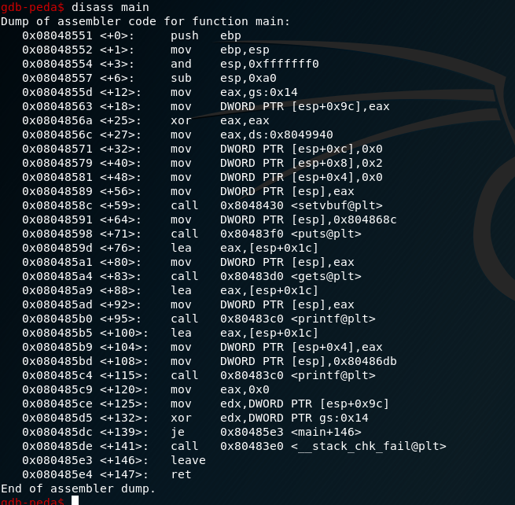

Challenge pwn4 from encrypt ctf 2019 was a format-string vulnerbility challenge

Let's check the security first:

And disassembly the main function using gdb:

We can see we have a canary enabled. In this case, much better exploitation matigition is to attack the GOT (Global Offset table), we can use this a format string attack which enables us to perform an arbitary write.

